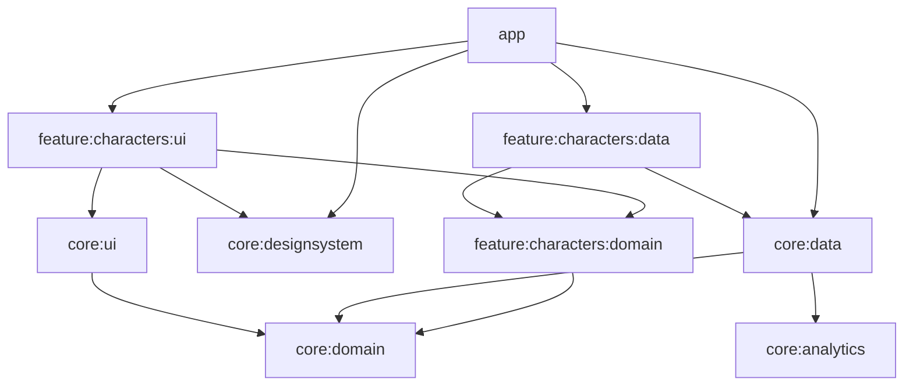

# RickMorty

Android app that lists the characters of [The Rick and Morty API](https://rickandmortyapi.com) and shows the detail of each one. It was built as a technical test.


https://github.com/user-attachments/assets/8a71b709-29cb-454e-9957-8a566487497a


## What it does

- Grid of characters with infinite scroll and pull to refresh.
- Search by name and filters by status, gender and species.
- Character detail with the episodes the character appears in.
- Light and dark theme. It follows the system until the user changes it, and the choice is saved.
- A notice when there is no connection. What was already downloaded can still be browsed.
- English and Spanish.

## Build and run

It needs JDK 17 or newer and an Android Studio version that supports AGP 9.4. The API needs no key. The minimum SDK is 26.

```bash
./gradlew build
./gradlew :app:installDebug
./gradlew :app:installRelease
```

`build` compiles every module and runs lint and the unit tests. The release build goes through R8 and is signed with the debug key, so it can be installed straight from a clone.

GitHub Actions runs the same `build` on every push to `main` and on every pull request (`.github/workflows/build.yml`).

## Modules



To keep the picture readable it leaves out the arrows from `app` and the feature modules to `core:domain` and `core:analytics`, and the `core:testing` module, which only the tests use.

| Module | What is in it |
| --- | --- |
| `app` | Application class, activity, navigation, theme setting |
| `build-logic` | Convention plugins shared by every module |
| `core:domain` | `Result`, `DataError`, `NetworkMonitor`, `ThemeRepository`. Plain Kotlin |
| `core:data` | Retrofit and OkHttp setup, `safeCall`, connectivity monitor, theme storage |
| `core:ui` | `UiText`, error messages, `ObserveAsEvents` |
| `core:designsystem` | Theme, spacing, `Rm*` components, icons, font |
| `core:analytics` | `AnalyticsTracker` and `ErrorReporter` with their Logcat implementations |
| `core:testing` | Fakes and rules shared by the unit tests |
| `feature:characters:domain` | Models, repository interfaces, `GetCharacterEpisodesUseCase`. Plain Kotlin |
| `feature:characters:data` | Retrofit APIs, DTOs, mappers, remote data source, repositories |
| `feature:characters:ui` | List and detail screens with their view models |

## Architecture

The feature is split in three layers, one module each. The UI and the data layer depend on the domain, and the domain depends on neither. The domain modules are plain Kotlin modules, so Gradle does not let them use Android or anything from the other layers.

Each screen follows MVI. The view model exposes one immutable state in a `StateFlow`, receives a sealed `Action` and, when it has to, sends one-off `Event`s through a `Channel`. Each screen has a `Root` composable that owns the view model and a stateless `Screen` that only gets the state and callbacks. The previews use the stateless one.

Errors are values. Repositories return `Result<D, DataError>`, exceptions are caught in a single place (`safeCall`) and the UI turns each `DataError` into a string resource.

Navigation uses Navigation 3. The back stack is a list owned by `app`. The feature module does not know the navigation library: its screens expose callbacks and `app` decides where to go.

Dependency injection uses Koin. Each module that provides dependencies declares its own Koin module, and a unit test checks that the whole graph can be resolved.

## Decisions

- **HTTP cache instead of a database.** The API answers with `Cache-Control: public, max-age=7776000, immutable`, so the OkHttp disk cache keeps responses for 90 days with no extra code. The repository also keeps in memory the characters it has already seen, so the detail shows the character without another request. Pull to refresh sends `no-cache`.
- **Pagination by hand, without Paging 3.** The repository returns the next page together with the characters and the view model hands it back untouched, so it never deals with page numbers. The API matches species by substring ("Human" also returns "Humanoid"). The data source keeps only the exact matches and the repository skips the pages that end up empty.
- **Use cases only when they add something.** `GetCharacterEpisodesUseCase` combines two repositories. Everything else calls the repository directly.
- **kotlinx.serialization.** Serializers are generated at compile time, so the DTOs need no R8 rules.
- **Coil behind `RmImage`.** `core:designsystem` is the only module that knows the image library.
- **UI models.** Screens never receive domain models. Mappers in the UI module convert them.
- **Analytics and error reporting behind interfaces.** Today the implementations write to Logcat. An R8 rule removes every `Log` call from the release build.
- **Fakes instead of a mocking library.** The remote data source is tested against MockWebServer.
- **Convention plugins.** `build-logic` holds the Android, Compose and JVM setup once, and the versions live in the version catalog.

## Tests

```bash
./gradlew test
```


Unit tests cover the view models, the repositories, the remote data source, the use case, the back stack rules and the Koin graph. There are no instrumented or UI tests.

## Known limits

- Species, type, origin and location are shown as the API sends them, in English.
- There is no local database. Browsing without connection depends on the HTTP cache.
- There is no specific layout for tablets or landscape.
- Analytics and error reporting only write to Logcat.

## Credits

- Data: [The Rick and Morty API](https://rickandmortyapi.com).
- Typeface: Jost, Copyright 2020 The Jost Project Authors, under the SIL Open Font License 1.1.
- Icons: Material Symbols by Google, under the Apache License 2.0.
